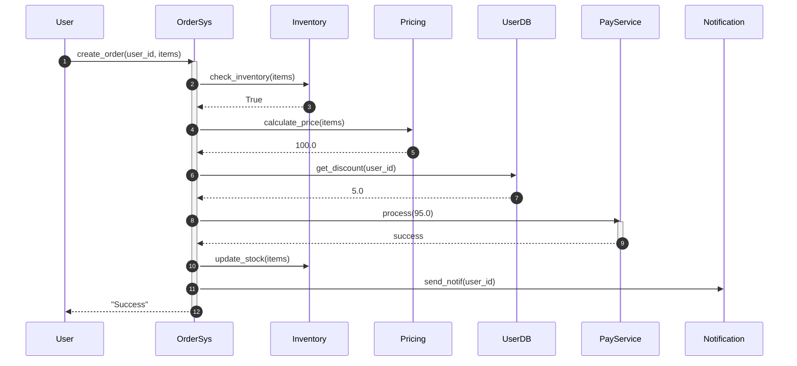
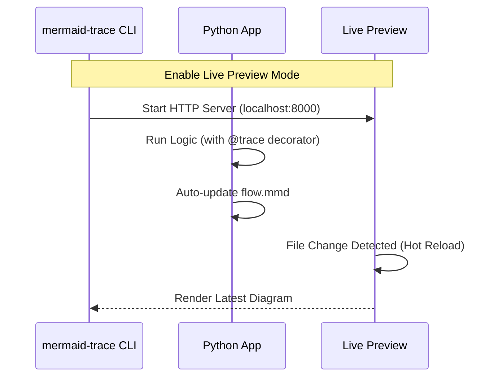

# MermaidTrace: Visualize Your Python Code Logic

**Stop drowning in cryptic logs. One line of code to transform complex execution logic into clear Mermaid sequence diagrams.**

🌐 **Language**: [English](README.md) | [中文](README_CN.md)

[](https://pypi.org/project/mermaid-trace/)
[](https://pypi.org/project/mermaid-trace/)
[](LICENSE)
[](https://github.com/xt765/mermaid-trace/actions/workflows/ci.yml)
[](https://codecov.io/gh/xt765/mermaid-trace)

---

## ⚡️ Understand MermaidTrace in 5 Seconds

#### 1. Original Code (15+ lines)
```python
@trace(source="User", target="OrderSys")
def create_order(user_id, items):
    # Complex business logic
    if not check_inventory(items):
        return "Out of Stock"

    # Nested logic calls
    price = calculate_price(items)
    discount = get_discount(user_id)
    final = price - discount

    # External service interactions
    res = pay_service.process(final)
    if res.success:
        update_stock(items)
        send_notif(user_id)
        return "Success"
    return "Failed"
```

#### 2. Auto-Generated Sequence Diagram


---

## 🚀 Dynamic Demo & Online Tryout

### 🎬 Quick Demo

*(From adding decorators to browser live preview in 10 seconds)*

### 🛠️ Try Online (Google Colab)

No local setup required. Experience core features in your browser:

[](https://colab.research.google.com/github/xt765/mermaid-trace/blob/main/examples/MermaidTrace_Demo.ipynb)

---

## 🎯 Why MermaidTrace? (Use Cases)

### 1. Master "Legacy" Codebases
**Pain**: Taking over a complex, undocumented legacy project with tangled function calls.
**Solution**: Add `@trace_class` or `@trace` to entry points and run the code once.
**Value**: Instantly generate a complete execution path map to understand the architecture.

### 2. Automated Technical Docs
**Pain**: Manual sequence diagrams are time-consuming and quickly become outdated.
**Solution**: Integrate MermaidTrace during development.
**Value**: Diagrams stay 100% in sync with your code logic automatically.

### 3. Debug Complex Recursion & Concurrency
**Pain**: Nested calls or async tasks produce interleaved logs that are impossible to read.
**Solution**: Use built-in async support and intelligent collapsing.
**Value**: Visualize recursion depth and concurrency flow to pinpoint logic bottlenecks.

---

## 🚀 Quick Start in 3 Steps

### 1. Install
```bash
pip install mermaid-trace
```

### 2. Add Decorators
```python
from mermaid_trace import trace, configure_flow

# Configure output file
configure_flow("my_flow.mmd")

@trace(source="User", target="AuthService")
def login(username):
    return verify_db(username)

@trace(source="AuthService", target="DB")
def verify_db(username):
    return True

login("admin")
```

### 3. View Diagram
Run your code and use the CLI tool for live preview (with hot-reload):
```bash
mermaid-trace serve my_flow.mmd
```

---

## ✨ Key Features

- **Decorator-Driven**: Simply add `@trace` or `@trace_interaction` to functions.
- **Auto-Instrumentation**: Use `@trace_class` to trace a whole class at once.
- **Third-Party Patching**: Use `patch_object` to trace calls inside external libraries.
- **Async Support**: Seamlessly works with `asyncio` coroutines and concurrency.
- **Intelligent Collapsing**: Automatically collapses repetitive calls and identifies loops.
- **FastAPI Integration**: Middleware for zero-config HTTP request tracing.
- **Detailed Exceptions**: Captures full stack traces for errors, displayed in the diagram.

---

## 📚 Documentation

### Core Documentation

[User Guide](docs/en/USER_GUIDE.md) · [API Reference](docs/en/API.md) · [Contributing Guidelines](docs/en/CONTRIBUTING.md) · [Changelog](docs/en/CHANGELOG.md) · [License](LICENSE)

### Code Comment Documents

| Category | Links |
| :--- | :--- |
| **Core Modules** | [Context](docs/en/code_comments/src/mermaid_trace/core/context.md) · [Decorators](docs/en/code_comments/src/mermaid_trace/core/decorators.md) · [Events](docs/en/code_comments/src/mermaid_trace/core/events.md) · [Formatter](docs/en/code_comments/src/mermaid_trace/core/formatter.md) |
| **Handlers** | [Async Handler](docs/en/code_comments/src/mermaid_trace/handlers/async_handler.md) · [Mermaid Handler](docs/en/code_comments/src/mermaid_trace/handlers/mermaid_handler.md) |
| **Integrations** | [FastAPI](docs/en/code_comments/src/mermaid_trace/integrations/fastapi.md) |
| **Others** | [init](docs/en/code_comments/src/mermaid_trace/__init__.md) · [CLI](docs/en/code_comments/src/mermaid_trace/cli.md) |

---

## 🤝 Contributing

We welcome contributions! Please see [CONTRIBUTING.md](docs/en/CONTRIBUTING.md) for details.

---

## 📄 License

MIT
