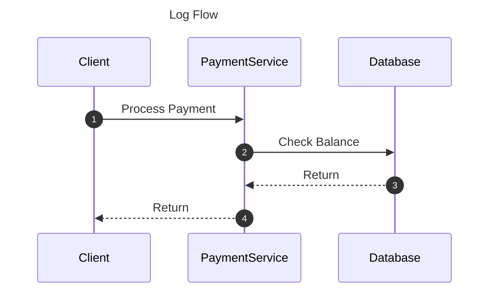

# MermaidTrace: The Python Logger That Draws Diagrams

**Stop reading logs. Start watching them.**

MermaidTrace is a specialized logging tool that automatically generates [Mermaid JS](https://mermaid.js.org/) sequence diagrams from your code execution. It's perfect for visualizing complex business logic, microservice interactions, or asynchronous flows.

## ✨ Features

- **Decorator-Driven**: Just add `@trace_interaction` to your functions.
- **Auto-Diagramming**: Generates `.mmd` files that can be viewed in VS Code, GitHub, or Mermaid Live Editor.
- **Async Support**: Works seamlessly with `asyncio` coroutines.
- **Zero Config**: Works out of the box with sensible defaults.

## 🚀 Quick Start

### Installation

```bash
pip install mermaid-trace
```

### Usage

```python
from mermaid_trace import trace_interaction, configure_flow
import time

# 1. Configure output
configure_flow("my_flow.mmd")

# 2. Add decorators
@trace_interaction("Client", "PaymentService", "Process Payment")
def process_payment(amount):
    if check_balance(amount):
        return "Success"
    return "Failed"

@trace_interaction("PaymentService", "Database", "Check Balance")
def check_balance(amount):
    return True

# 3. Run your code
process_payment(100)
```

### Output (`my_flow.mmd`)



## 🛠 Advanced

### Context Tracking (Coming Soon)
MermaidTrace will soon support automatic `source` inference using ContextVars, so you won't need to manually specify the caller every time.

## License

MIT
