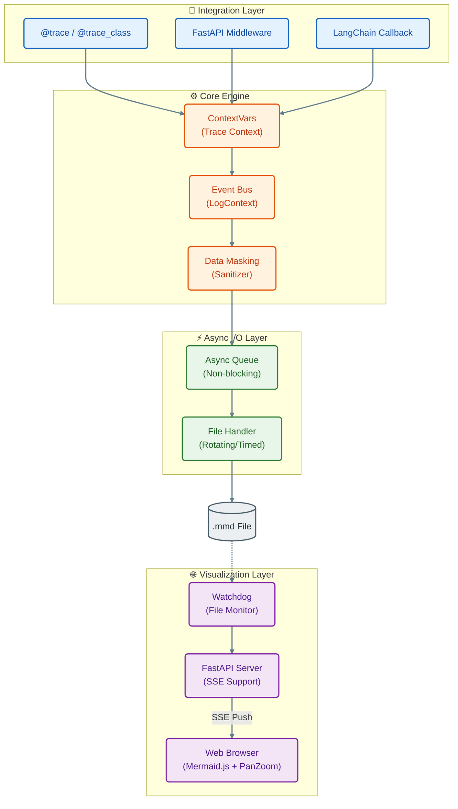

# MermaidTrace 🧜‍♀️

<div align="center">

[](https://pypi.org/project/mermaid-trace/)
[](https://pypi.org/project/mermaid-trace/)
[](https://github.com/xt765/mermaid-trace/blob/main/LICENSE)
[](https://pepy.tech/project/mermaid-trace)

**Stop guessing, start seeing.**  
Transform your Python runtime execution into live, interactive sequence diagrams.

[**中文文档**](README_CN.md) | [**Documentation**](docs/en/USER_GUIDE.md) | [**Blog**](docs/zh/BLOG.md)

</div>

---

## 📖 Introduction

**MermaidTrace** is a lightweight, non-invasive tool that visualizes Python code execution flow as Mermaid sequence diagrams. Designed for **AsyncIO** and **Microservices**, it helps you debug complex logic, understand legacy code, and document system behavior automatically.

### Architecture


```mermaid
flowchart TB
    %% Style Definitions
    classDef userLayer fill:#e3f2fd,stroke:#1565c0,stroke-width:2px,color:#0d47a1,rx:5,ry:5
    classDef coreLayer fill:#fff3e0,stroke:#e65100,stroke-width:2px,color:#bf360c,rx:5,ry:5
    classDef ioLayer fill:#e8f5e9,stroke:#2e7d32,stroke-width:2px,color:#1b5e20,rx:5,ry:5
    classDef vizLayer fill:#f3e5f5,stroke:#7b1fa2,stroke-width:2px,color:#4a148c,rx:5,ry:5
    classDef storage fill:#eceff1,stroke:#455a64,stroke-width:2px,color:#263238,shape:cyl

    subgraph User["👤 Integration Layer"]
        direction TB
        Decorator["@trace / @trace_class"]:::userLayer
        Middleware["FastAPI Middleware"]:::userLayer
        Callback["LangChain Callback"]:::userLayer
    end

    subgraph Core["⚙️ Core Engine"]
        direction TB
        Context["ContextVars<br/>(Trace Context)"]:::coreLayer
        EventBus["Event Bus<br/>(LogContext)"]:::coreLayer
        Masker["Data Masking<br/>(Sanitizer)"]:::coreLayer
    end

    subgraph IO["⚡ Async I/O Layer"]
        direction TB
        Queue["Async Queue<br/>(Non-blocking)"]:::ioLayer
        Writer["File Handler<br/>(Rotating/Timed)"]:::ioLayer
    end

    Storage[(".mmd File")]:::storage

    subgraph Viz["🌐 Visualization Layer"]
        direction TB
        Watcher["Watchdog<br/>(File Monitor)"]:::vizLayer
        Server["FastAPI Server<br/>(SSE Support)"]:::vizLayer
        Browser["Web Browser<br/>(Mermaid.js + PanZoom)"]:::vizLayer
    end

    %% Data Flow
    Decorator --> Context
    Middleware --> Context
    Callback --> Context
    Context --> EventBus
    EventBus --> Masker
    Masker --> Queue
    Queue --> Writer
    Writer --> Storage
    Storage -.-> Watcher
    Watcher --> Server
    Server == "SSE Push" ==> Browser

    %% Link Style
    linkStyle default stroke:#607d8b,stroke-width:2px
```

## 💡 Core Philosophy

*   **Non-Invasive**: Use `@trace` decorators or `trace_class` to instrument your code without modifying business logic.
*   **Async-First**: Built on `contextvars` to ensure trace continuity across `await` points and thread pools.
*   **High Performance**: Uses non-blocking `asyncio.Queue` and background threads for I/O, ensuring minimal impact on your application's throughput.
*   **Privacy-Aware**: Built-in data masking automatically sanitizes sensitive fields like passwords and tokens.

## ✨ Key Features (v0.7.0)

-   **Unified CLI**: `mermaid-trace serve` provides a full-featured web preview with hot-reload, pan/zoom, and file browsing.
-   **Distributed Tracing**: Propagate Trace IDs across microservices via HTTP headers (W3C/B3 support).
-   **Smart Sampling**: Configurable sampling rates for high-traffic production environments.
-   **Rich Integrations**: First-class support for **FastAPI** middleware and **LangChain** callbacks.

## 🚀 Quick Start

### 1. Installation

```bash
pip install mermaid-trace[server]
```

### 2. Basic Usage

```python
from mermaid_trace import trace, configure_flow

# Configure output file
configure_flow("flow.mmd")

@trace(source="User", target="System")
def login(username):
    if verify(username):
        return "Success"
    return "Fail"

@trace(source="System", target="Database")
def verify(username):
    return True

if __name__ == "__main__":
    login("Alice")
```

### 3. Live Preview

Run the CLI to start the enhanced web server:

```bash
mermaid-trace serve flow.mmd
```

Open your browser at `http://localhost:8000` to see the live diagram updates as you code.

## 🧩 Integrations

### FastAPI Middleware

```python
from fastapi import FastAPI
from mermaid_trace.integrations.fastapi import MermaidTraceMiddleware

app = FastAPI()
app.add_middleware(MermaidTraceMiddleware, app_name="MyAPI")
```

### LangChain Callback

```python
from mermaid_trace.integrations.langchain import MermaidTraceCallbackHandler
from langchain_openai import ChatOpenAI

handler = MermaidTraceCallbackHandler(trace_name="AgentFlow")
llm = ChatOpenAI(callbacks=[handler])
```

## 🤝 Contributing

We welcome contributions! Please see [CONTRIBUTING.md](docs/en/CONTRIBUTING.md) for details.

## 📄 License

This project is licensed under the MIT License - see the [LICENSE](LICENSE) file for details.
