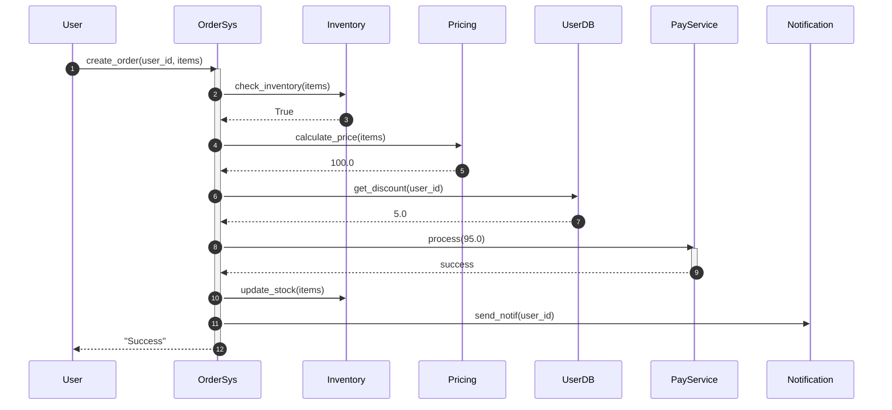
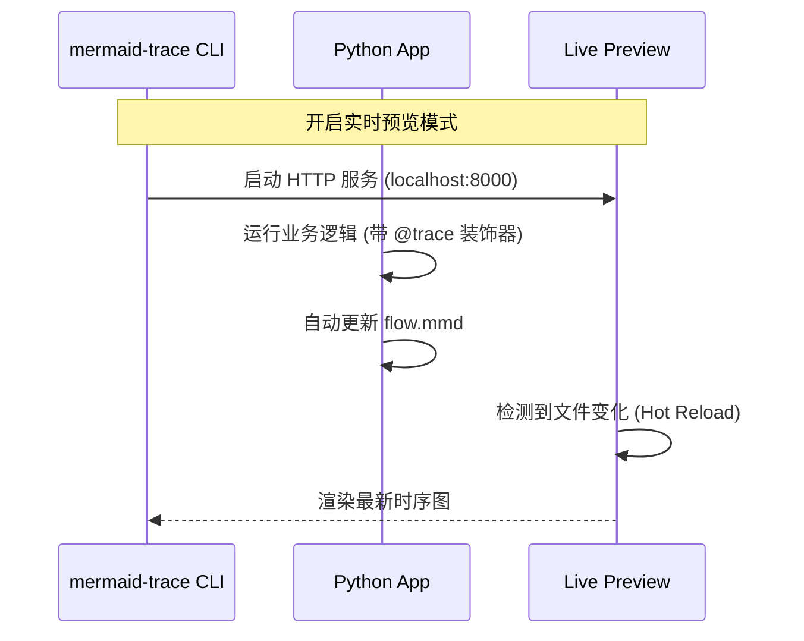

# MermaidTrace: 让你的 Python 代码逻辑“看”得见

**别再深陷于晦涩的日志流了。只需一行代码，自动将复杂的执行逻辑转化为清晰的 Mermaid 时序图。**

🌐 **语言**: [English](README.md) | [中文](README_CN.md)

[](https://pypi.org/project/mermaid-trace/)
[](https://pypi.org/project/mermaid-trace/)
[](LICENSE)
[](https://github.com/xt765/mermaid-trace/actions/workflows/ci.yml)
[](https://codecov.io/gh/xt765/mermaid-trace)

---

## ⚡️ 5秒钟看懂 MermaidTrace

#### 1. 原始代码 (15+ 行)
```python
@trace(source="User", target="OrderSys")
def create_order(user_id, items):
    # 复杂的业务校验
    if not check_inventory(items):
        return "Out of Stock"

    # 嵌套的逻辑调用
    price = calculate_price(items)
    discount = get_discount(user_id)
    final = price - discount

    # 外部服务交互
    res = pay_service.process(final)
    if res.success:
        update_stock(items)
        send_notif(user_id)
        return "Success"
    return "Failed"
```

#### 2. MermaidTrace 自动生成的时序图


---

## 🚀 动态演示与在线试用

### 🎬 快速演示

*(从代码添加装饰器到浏览器实时预览，全流程只需10秒)*

### 🛠️ 在线试用 (Google Colab)

无需安装环境，在浏览器中立即体验核心功能：

[](https://colab.research.google.com/github/xt765/mermaid-trace/blob/main/examples/MermaidTrace_Demo_CN.ipynb)

---

## 📚 文档中心

### 核心文档

[用户指南](docs/zh/USER_GUIDE.md) · [API 参考](docs/zh/API.md) · [贡献指南](docs/zh/CONTRIBUTING.md) · [更新日志](docs/zh/UPDATE_LOG.md) · [许可证](LICENSE)

### 源码详细注释 (中文)

| 分类 | 文档链接 |
| :--- | :--- |
| **核心模块** | [上下文 (Context)](docs/zh/code_comments/src/mermaid_trace/core/context.md) · [装饰器 (Decorators)](docs/zh/code_comments/src/mermaid_trace/core/decorators.md) · [事件系统 (Events)](docs/zh/code_comments/src/mermaid_trace/core/events.md) · [格式化器 (Formatter)](docs/zh/code_comments/src/mermaid_trace/core/formatter.md) |
| **处理器 (Handlers)** | [异步处理器 (Async)](docs/zh/code_comments/src/mermaid_trace/handlers/async_handler.md) · [Mermaid 处理器](docs/zh/code_comments/src/mermaid_trace/handlers/mermaid_handler.md) |
| **框架集成** | [FastAPI 集成](docs/zh/code_comments/src/mermaid_trace/integrations/fastapi.md) |
| **其他** | [入口 (Init)](docs/zh/code_comments/src/mermaid_trace/__init__.md) · [命令行 (CLI)](docs/zh/code_comments/src/mermaid_trace/cli.md) |

---

## 🎯 为什么选择 MermaidTrace？（应用场景）

### 1. 快速接手“屎山”代码
**痛点**：接手维护一个逻辑极其复杂、缺乏文档的遗留项目，完全看不懂函数间的调用关系。
**方案**：在入口函数添加 `@trace_class` 或 `@trace`，运行一遍代码。
**价值**：一键生成完整的业务执行路径图，瞬间理清代码脉络。

### 2. 自动化技术文档
**痛点**：手动绘制时序图非常耗时，且代码更新后文档往往滞后。
**方案**：在开发阶段集成 MermaidTrace。
**价值**：让代码自己生成文档，确保图表与代码逻辑始终 100% 同步。

### 3. 调试复杂递归与并发
**痛点**：多层嵌套调用或异步并发时，`print` 日志交织在一起，极难调试。
**方案**：利用 MermaidTrace 的异步支持和智能折叠功能。
**价值**：可视化递归深度与并发顺序，快速定位逻辑瓶颈或异常点。

---

## 🚀 3步快速开始

### 1. 安装
```bash
pip install mermaid-trace
```

### 2. 在代码中添加装饰器
```python
from mermaid_trace import trace, configure_flow

# 配置输出文件
configure_flow("my_flow.mmd")

@trace(source="User", target="AuthService")
def login(username):
    return verify_db(username)

@trace(source="AuthService", target="DB")
def verify_db(username):
    return True

login("admin")
```

### 3. 查看图表
运行代码后，使用内置 CLI 工具实时预览（支持热重载）：
```bash
mermaid-trace serve my_flow.mmd
```

---

## ✨ 核心特性

- **装饰器驱动**：只需在函数上添加 `@trace` 或 `@trace_interaction` 即可。
- **批量追踪**：使用 `@trace_class` 一次性追踪整个类的方法。
- **第三方库追踪**：使用 `patch_object` 对外部库方法做 patch 并加入追踪。
- **异步支持**：无缝支持 `asyncio` 协程与并发。
- **智能折叠**：自动折叠重复的高频调用和识别循环模式，防止图表过载。
- **FastAPI 集成**：内置中间件，实现零配置的 HTTP 请求追踪。
- **详细异常堆栈**：自动捕获完整的错误堆栈并在图表中显示。

---

## 🤝 贡献

欢迎贡献！详情请参阅 [CONTRIBUTING.md](docs/zh/CONTRIBUTING.md)。

---

## 📄 许可证

MIT
