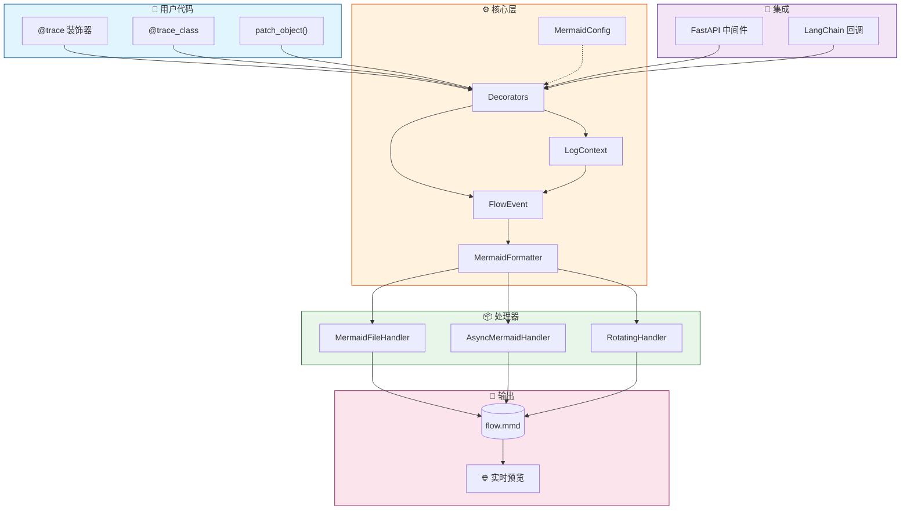
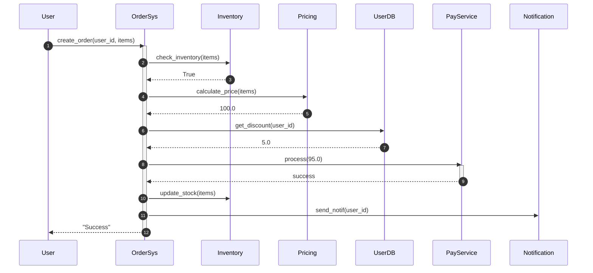
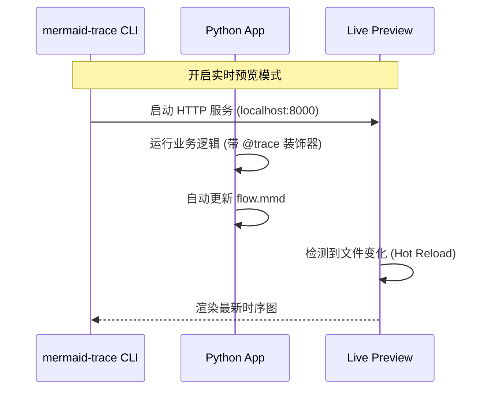

<h1 align="center">MermaidTrace: 让你的 Python 代码逻辑"看"得见</h1>
<p align="center">
  
</p>
<p align="center"><strong>别再深陷于晦涩的日志流了。只需一行代码，自动将复杂的执行逻辑转化为清晰的 Mermaid 时序图。</strong></p>

<p align="center">🌐 <strong>语言</strong>: <a href="README.md">English</a> | <a href="README_CN.md">中文</a></p>

<p align="center">
  <a href="https://blog.csdn.net/Yunyi_Chi"></a>
  <a href="https://github.com/xt765/mermaid-trace"></a>
  <a href="https://gitee.com/xt765/mermaid-trace"></a>
</p>
<p align="center">
  <a href="https://pypi.org/project/mermaid-trace/"></a>
  <a href="https://pepy.tech/projects/mermaid-trace"></a>
  <a href="https://pypi.org/project/mermaid-trace/"></a>
  <a href="LICENSE"></a>
  <a href="https://github.com/xt765/mermaid-trace/actions/workflows/ci.yml"></a>
  <a href="https://docs.astral.sh/ruff/"></a>
  <a href="https://mypy.readthedocs.io/"></a>
</p>

## 🏗️ 架构图


```mermaid
flowchart TB
    subgraph User["👤 用户代码"]
        A["@trace 装饰器"]
        B["@trace_class"]
        C["patch_object()"]
    end

    subgraph Core["⚙️ 核心层"]
        D["Decorators"]
        E["LogContext"]
        F["FlowEvent"]
        G["MermaidFormatter"]
        H["MermaidConfig"]
    end

    subgraph Handlers["📦 处理器"]
        I["MermaidFileHandler"]
        J["AsyncMermaidHandler"]
        K["RotatingHandler"]
    end

    subgraph Output["📄 输出"]
        L[("flow.mmd")]
        M["🌐 实时预览"]
    end

    subgraph Integrations["🔗 集成"]
        N["FastAPI 中间件"]
        O["LangChain 回调"]
    end

    A --> D
    B --> D
    C --> D
    D --> E
    D --> F
    E --> F
    F --> G
    H -.-> D
    G --> I
    G --> J
    G --> K
    I --> L
    J --> L
    K --> L
    L --> M
    N --> D
    O --> D

    style User fill:#e1f5fe,stroke:#01579b
    style Core fill:#fff3e0,stroke:#e65100
    style Handlers fill:#e8f5e9,stroke:#1b5e20
    style Output fill:#fce4ec,stroke:#880e4f
    style Integrations fill:#f3e5f5,stroke:#4a148c
```

---

## ⚡️ 5秒钟看懂 MermaidTrace

#### 1. 原始代码 (15+ 行)

```python
@trace(source="User", target="OrderSys")
def create_order(user_id, items):
    # 复杂的业务校验
    if not check_inventory(items):
        return "Out of Stock"

    # 嵌套的逻辑调用
    price = calculate_price(items)
    discount = get_discount(user_id)
    final = price - discount

    # 外部服务交互
    res = pay_service.process(final)
    if res.success:
        update_stock(items)
        send_notif(user_id)
        return "Success"
    return "Failed"
```

#### 2. MermaidTrace 自动生成的时序图


```mermaid
sequenceDiagram
    autonumber
    User->>OrderSys: create_order(user_id, items)
    activate OrderSys
    OrderSys->>Inventory: check_inventory(items)
    Inventory-->>OrderSys: True
    OrderSys->>Pricing: calculate_price(items)
    Pricing-->>OrderSys: 100.0
    OrderSys->>UserDB: get_discount(user_id)
    UserDB-->>OrderSys: 5.0
    OrderSys->>PayService: process(95.0)
    activate PayService
    PayService-->>OrderSys: success
    deactivate PayService
    OrderSys->>Inventory: update_stock(items)
    OrderSys->>Notification: send_notif(user_id)
    OrderSys-->>User: "Success"
    deactivate OrderSys
```

---

## 🚀 动态演示与在线试用

### 🎬 快速演示


*(Master 模式预览：支持多文件切换、实时刷新、缩放与平移)*


```mermaid
sequenceDiagram
    participant CLI as mermaid-trace CLI
    participant App as Python App
    participant Web as Live Preview

    Note over CLI, Web: 开启实时预览模式
    CLI->>Web: 启动 HTTP 服务 (localhost:8000)
    App->>App: 运行业务逻辑 (带 @trace 装饰器)
    App->>App: 自动更新 flow.mmd
    Web->>Web: 检测到文件变化 (Hot Reload)
    Web-->>CLI: 渲染最新时序图
```

*(从代码添加装饰器到浏览器实时预览，全流程只需10秒)*

### 🛠️ 在线试用 (Google Colab)

无需安装环境，在浏览器中立即体验核心功能：

[](https://colab.research.google.com/github/xt765/mermaid-trace/blob/main/examples/MermaidTrace_Demo_CN.ipynb)

---

## 📚 文档中心

### 核心文档

[用户指南](docs/zh/USER_GUIDE.md) · [API 参考](docs/zh/API.md) · [贡献指南](docs/zh/CONTRIBUTING.md) · [更新日志](docs/zh/UPDATE_LOG.md) · [许可证](LICENSE)

### 源码详细注释 (中文)

| 分类                        | 文档链接                                                                                                                                                                                                                                                                                                                 |
| :-------------------------- | :----------------------------------------------------------------------------------------------------------------------------------------------------------------------------------------------------------------------------------------------------------------------------------------------------------------------- |
| **核心模块**          | [上下文 (Context)](docs/zh/code_comments/src/mermaid_trace/core/context.md) · [装饰器 (Decorators)](docs/zh/code_comments/src/mermaid_trace/core/decorators.md) · [事件系统 (Events)](docs/zh/code_comments/src/mermaid_trace/core/events.md) · [格式化器 (Formatter)](docs/zh/code_comments/src/mermaid_trace/core/formatter.md) |
| **处理器 (Handlers)** | [异步处理器 (Async)](docs/zh/code_comments/src/mermaid_trace/handlers/async_handler.md) · [Mermaid 处理器](docs/zh/code_comments/src/mermaid_trace/handlers/mermaid_handler.md)                                                                                                                                               |
| **框架集成**          | [FastAPI 集成](docs/zh/code_comments/src/mermaid_trace/integrations/fastapi.md)                                                                                                                                                                                                                                             |
| **其他**              | [入口 (Init)](docs/zh/code_comments/src/mermaid_trace/__init__.md) · [命令行 (CLI)](docs/zh/code_comments/src/mermaid_trace/cli.md)                                                                                                                                                                                           |

---

## 🎯 为什么选择 MermaidTrace？（应用场景）

### 1. 快速接手“屎山”代码

**痛点**：接手维护一个逻辑极其复杂、缺乏文档的遗留项目，完全看不懂函数间的调用关系。
**方案**：在入口函数添加 `@trace_class` 或 `@trace`，运行一遍代码。
**价值**：一键生成完整的业务执行路径图，瞬间理清代码脉络。

### 2. 自动化技术文档

**痛点**：手动绘制时序图非常耗时，且代码更新后文档往往滞后。
**方案**：在开发阶段集成 MermaidTrace。
**价值**：让代码自己生成文档，确保图表与代码逻辑始终 100% 同步。

### 3. 调试复杂递归与并发

**痛点**：多层嵌套调用或异步并发时，`print` 日志交织在一起，极难调试。
**方案**：利用 MermaidTrace 的异步支持和智能折叠功能。
**价值**：可视化递归深度与并发顺序，快速定位逻辑瓶颈或异常点。

---

## 🚀 3步快速开始

### 1. 安装

```bash
pip install mermaid-trace
```

### 2. 在代码中添加装饰器

```python
from mermaid_trace import trace, configure_flow

# 配置输出文件
configure_flow("my_flow.mmd")

@trace(source="User", target="AuthService")
def login(username):
    return verify_db(username)

@trace(source="AuthService", target="DB")
def verify_db(username):
    return True

login("admin")
```

### 3. 查看图表

运行代码后，使用内置 CLI 工具实时预览（支持热重载）：

```bash
# 基础预览
mermaid-trace serve my_flow.mmd

# Master 模式 (支持目录浏览、缩放、多文件切换)
mermaid-trace serve . --master
# 或者在 Master 模式下预览特定文件
mermaid-trace serve .\mermaid_diagrams\examples\08-log-rotation.mmd --master
```

### 🔗 LangChain 集成

通过简单的 Callback Handler 即可可视化 LLM 链、Agent 和 RAG 流程：

```python
from mermaid_trace.integrations.langchain import MermaidTraceCallbackHandler

handler = MermaidTraceCallbackHandler(host_name="我的AI应用")
# 传入任何 LangChain 对象
chain.invoke({"input": "..."}, config={"callbacks": [handler]})
```

---

## ✨ 核心特性

- **装饰器驱动**：只需在函数上添加 `@trace` 或 `@trace_interaction` 即可。
- **批量追踪**：使用 `@trace_class` 一次性追踪整个类的方法。
- **第三方库追踪**：使用 `patch_object` 对外部库方法做 patch 并加入追踪。
- **异步支持**：无缝支持 `asyncio` 协程与并发。
- **增强型 Web UI**：交互式预览服务器，支持文件列表、自动刷新和缩放平移（使用 `--master`）。
- **智能折叠**：自动折叠重复的高频调用和识别循环模式，防止图表过载。
- **FastAPI 集成**：内置中间件，实现零配置的 HTTP 请求追踪。
- **LangChain 集成**：提供 Callback Handler，可视化 LLM 链、Agent 工具调用及 RAG 检索路径。
- **详细异常堆栈**：自动捕获完整的错误堆栈并在图表中显示。

---

## 🤝 贡献

欢迎贡献！详情请参阅 [CONTRIBUTING.md](docs/zh/CONTRIBUTING.md)。

---

## 📄 许可证

MIT
