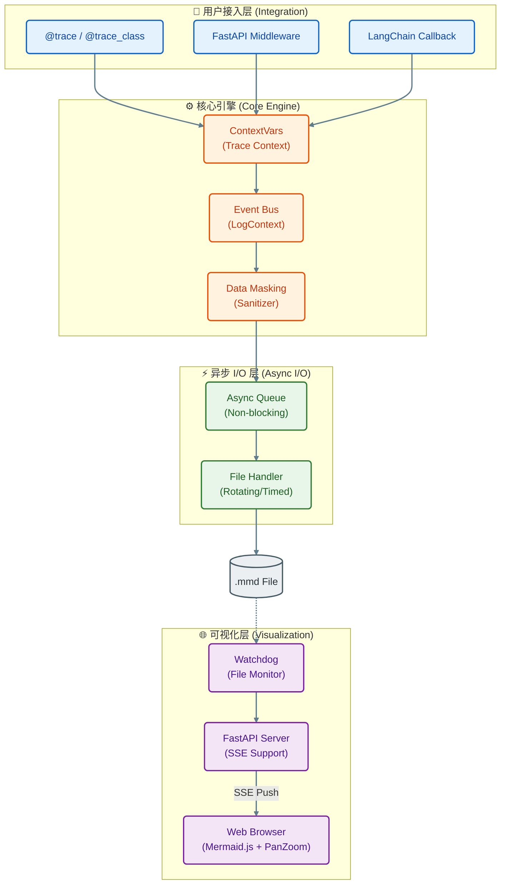

# MermaidTrace 🧜‍♀️

<div align="center">

[](https://pypi.org/project/mermaid-trace/)
[](https://pypi.org/project/mermaid-trace/)
[](https://github.com/xt765/mermaid-trace/blob/main/LICENSE)
[](https://pepy.tech/project/mermaid-trace)

**告别猜测，眼见为实。**  
将 Python 代码的运行时执行流，实时转化为交互式时序图。

[**English Docs**](README.md) | [**用户指南**](docs/zh/USER_GUIDE.md) | [**技术博客**](docs/zh/BLOG.md)

</div>

---

## 📖 简介

**MermaidTrace** 是一个轻量级、非侵入式的工具，能够将 Python 代码的执行路径可视化为 Mermaid 时序图。专为 **AsyncIO** 和 **微服务** 设计，它能帮助你调试复杂逻辑、理解遗留代码，并自动生成系统行为文档。

### 架构概览


```mermaid
flowchart TB
    %% 样式定义
    classDef userLayer fill:#e3f2fd,stroke:#1565c0,stroke-width:2px,color:#0d47a1,rx:5,ry:5
    classDef coreLayer fill:#fff3e0,stroke:#e65100,stroke-width:2px,color:#bf360c,rx:5,ry:5
    classDef ioLayer fill:#e8f5e9,stroke:#2e7d32,stroke-width:2px,color:#1b5e20,rx:5,ry:5
    classDef vizLayer fill:#f3e5f5,stroke:#7b1fa2,stroke-width:2px,color:#4a148c,rx:5,ry:5
    classDef storage fill:#eceff1,stroke:#455a64,stroke-width:2px,color:#263238,shape:cyl

    subgraph User["👤 用户接入层 (Integration)"]
        direction TB
        Decorator["@trace / @trace_class"]:::userLayer
        Middleware["FastAPI Middleware"]:::userLayer
        Callback["LangChain Callback"]:::userLayer
    end

    subgraph Core["⚙️ 核心引擎 (Core Engine)"]
        direction TB
        Context["ContextVars<br/>(Trace Context)"]:::coreLayer
        EventBus["Event Bus<br/>(LogContext)"]:::coreLayer
        Masker["Data Masking<br/>(Sanitizer)"]:::coreLayer
    end

    subgraph IO["⚡ 异步 I/O 层 (Async I/O)"]
        direction TB
        Queue["Async Queue<br/>(Non-blocking)"]:::ioLayer
        Writer["File Handler<br/>(Rotating/Timed)"]:::ioLayer
    end

    Storage[(".mmd File")]:::storage

    subgraph Viz["🌐 可视化层 (Visualization)"]
        direction TB
        Watcher["Watchdog<br/>(File Monitor)"]:::vizLayer
        Server["FastAPI Server<br/>(SSE Support)"]:::vizLayer
        Browser["Web Browser<br/>(Mermaid.js + PanZoom)"]:::vizLayer
    end

    %% 数据流向
    Decorator --> Context
    Middleware --> Context
    Callback --> Context
    Context --> EventBus
    EventBus --> Masker
    Masker --> Queue
    Queue --> Writer
    Writer --> Storage
    Storage -.-> Watcher
    Watcher --> Server
    Server == "SSE Push" ==> Browser

    %% 连接样式
    linkStyle default stroke:#607d8b,stroke-width:2px
```

## 💡 核心理念

*   **非侵入式**: 使用 `@trace` 装饰器或 `trace_class` 对代码进行插桩，无需修改业务逻辑。
*   **异步优先**: 基于 `contextvars` 构建，确保在 `await` 挂起和线程池切换时追踪链路不中断。
*   **高性能**: 采用无锁 `asyncio.Queue` 和后台独立线程处理 I/O，确保对主业务吞吐量的影响降至最低。
*   **隐私安全**: 内置数据脱敏机制，自动清洗密码、Token 等敏感字段。

## ✨ 关键特性 (v0.7.0)

-   **统一 CLI**: `mermaid-trace serve` 提供全功能的 Web 预览，支持热重载、交互式缩放和平移以及文件浏览。
-   **分布式追踪**: 通过 HTTP Header (W3C/B3) 在微服务间传播 Trace ID，串联全链路调用。
-   **智能采样**: 可配置采样率，适应高并发生产环境。
-   **生态集成**: 对 **FastAPI** 中间件和 **LangChain** 回调提供原生支持。

## 🚀 快速上手

### 1. 安装

```bash
pip install mermaid-trace[server]
```

### 2. 基础用法

```python
from mermaid_trace import trace, configure_flow

# 配置输出文件
configure_flow("flow.mmd")

@trace(source="User", target="System")
def login(username):
    if verify(username):
        return "Success"
    return "Fail"

@trace(source="System", target="Database")
def verify(username):
    return True

if __name__ == "__main__":
    login("Alice")
```

### 3. 实时预览

运行 CLI 启动增强型 Web 服务器：

```bash
mermaid-trace serve flow.mmd
```

浏览器打开 `http://localhost:8000`，即可看到图表随代码执行实时更新。

## 🧩 生态集成

### FastAPI 中间件

```python
from fastapi import FastAPI
from mermaid_trace.integrations.fastapi import MermaidTraceMiddleware

app = FastAPI()
app.add_middleware(MermaidTraceMiddleware, app_name="MyAPI")
```

### LangChain 回调

```python
from mermaid_trace.integrations.langchain import MermaidTraceCallbackHandler
from langchain_openai import ChatOpenAI

handler = MermaidTraceCallbackHandler(trace_name="AgentFlow")
llm = ChatOpenAI(callbacks=[handler])
```

## 🤝 贡献指南

欢迎贡献代码！详情请参阅 [CONTRIBUTING.md](docs/zh/CONTRIBUTING.md)。

## 📄 许可证

本项目采用 MIT 许可证 - 详见 [LICENSE](LICENSE) 文件。
