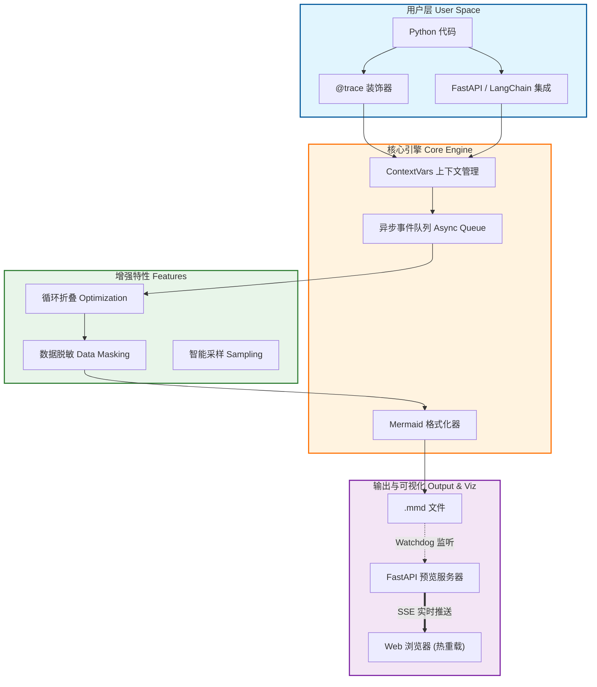
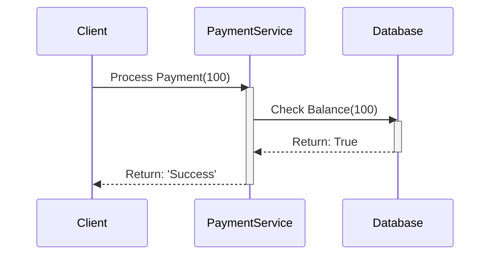
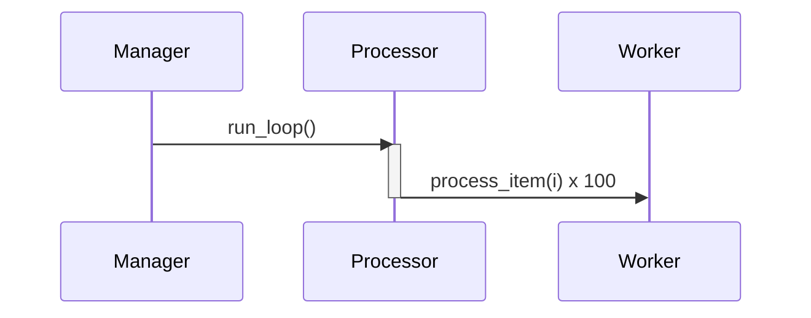

<div align="center">
  
  <h1><strong>玄同 765</strong></h1>
  <p><strong>大语言模型 (LLM) 开发工程师 | 中国传媒大学 · 数字媒体技术（智能交互与游戏设计）</strong></p>
  <p>
    <a href="https://blog.csdn.net/Yunyi_Chi" target="_blank" style="text-decoration: none;">
      <span style="background-color: #f39c12; color: white; padding: 2px 8px; border-radius: 4px; font-size: 12px; font-weight: bold; display: inline-block;">CSDN · 个人主页 |</span>
    </a>
    <a href="https://github.com/xt765" target="_blank" style="text-decoration: none; margin-left: 8px;">
      <span style="background-color: #24292e; color: white; padding: 2px 8px; border-radius: 4px; font-size: 12px; font-weight: bold; display: inline-block;">GitHub · Follow</span>
    </a>
  </p>
</div>

---

### **关于作者**

- **深耕领域**：大语言模型开发 / RAG 知识库 / AI Agent 落地 / 模型微调
- **技术栈**：Python | RAG (LangChain / Dify + Milvus) | FastAPI + Docker
- **工程能力**：专注模型工程化部署、知识库构建与优化，擅长全流程解决方案

> **「让 AI 交互更智能，让技术落地更高效」**
> 欢迎技术探讨与项目合作，解锁大模型与智能交互的无限可能！

---


### **前言：代码执行流的“黑盒”困境**

**【重磅更新】MermaidTrace 现已迭代至 v0.7.0，带来统一的 CLI 体验与分布式追踪支持！**

作为一名开发者，在日常开发中，你是否也曾遇到这样的困扰：
- **日志海洋迷航**：面对海量文本日志，一眼难以梳理出核心交互流程。
- **微服务链路黑盒**：跨服务调用时，Trace ID 传递断层，无法串联完整的业务路径。
- **排查故障全靠脑补**：排查线上故障时，需要人肉在脑海中构建调用链路，费时费力。
- **敏感数据泄露风险**：日志中不小心打印了用户密码或 Token，面临合规风险。

这让我萌生了一个想法：**开发一个工具，让它能将真实的“运行时调用”，自动转化为“可视化图表”**。

于是，**MermaidTrace** 诞生了。它让代码“自己画画”，把那些被代码淹没的逻辑，瞬间清晰可见！

---

### **0.7.0 版本重大更新亮点 🚀**

在 v0.7.0 中，我们专注于**体验统一**与**企业级特性**：

1.  **CLI 体验大一统**：
    - 彻底重构命令行工具，现在只需运行 `mermaid-trace serve`。
    - 无论是**单个文件**还是**整个目录**，默认开启增强型 Web 预览（Master 模式）。
    - 支持 **SSE 实时热重载**、**交互式缩放/平移**，无需再记忆繁琐的参数。
2.  **分布式追踪模拟**：
    
    - 新增 `10_distributed_trace_simulation.py` 示例，演示如何在微服务间传递 Trace Context。
    - 支持 **W3C Trace Context**、**B3** 等标准头，轻松串联跨服务调用。
3.  **数据隐私与采样**：
    - **自动脱敏**：内置 `DataMasker`，自动识别并屏蔽 `password`、`token` 等敏感字段。
    - **采样策略**：新增 `sample_rate` 配置，在高并发场景下按比例采集 Trace，降低性能开销。
4.  **LangChain 集成增强**：
    - 即使未安装 LangChain 库，也能通过 Mock 模式体验集成效果，大幅降低上手门槛。
    - 修复了 Python 对象表示中的特殊字符（如 `<`、`>`）导致的渲染错误。

---

### **核心功能：深度解码运行时行为**

#### **1. 运行时真实追踪**
装饰器即开即用，精准还原代码执行路径。

```python
from mermaid_trace import trace, configure_flow

# 初始化配置，指定输出文件，开启覆盖模式
configure_flow("flow.mmd", overwrite=True)

@trace(source="Client", target="PaymentService", action="Process Payment")
def process_payment(amount):
    if check_balance(amount):
        return "Success"
    return "Failed"

@trace(source="PaymentService", target="Database", action="Check Balance")
def check_balance(amount):
    return True

# 执行业务逻辑
process_payment(100)
```

**生成的图表效果：**



#### **2. 智能折叠与优化**
自动合并循环中的高频重复调用，让图表告别“爆炸”。

```python
from mermaid_trace import trace

@trace(target="Worker")
def process_item(i):
    return i * 10

@trace(source="Manager", target="Processor")
def run_loop():
    for i in range(100):
        process_item(i)

# 自动将 100 次调用合并为一条带计数的记录
run_loop()
```

**生成的图表效果：**



#### **3. 分布式追踪与上下文传播**
支持在异步任务和跨服务调用中保持 Trace 上下文。

```python
@trace(source="ServiceA", target="ServiceB")
async def call_remote_service():
    # 自动注入 Trace ID 到 headers
    headers = {} 
    inject_trace_context(headers)
    await http_client.get("http://service-b", headers=headers)
```

#### **4. 数据脱敏 (Data Masking)**
保护敏感数据不落盘。

```python
from mermaid_trace import trace

# 自动屏蔽 password 参数
@trace
def login(username, password):
    pass

login("admin", "secret123")
# 图表中显示: login("admin", "***")
```

#### **5. 生态无缝集成**
提供 FastAPI 中间件与 LangChain Callback，实现零配置接入。

```python
from fastapi import FastAPI
from mermaid_trace.integrations.fastapi import MermaidTraceMiddleware

app = FastAPI()
app.add_middleware(MermaidTraceMiddleware, app_name="MyAPI")
```

---

### **快速上手：三步开启可视化之旅**

#### **1. 安装 MermaidTrace**
```bash
# 安装核心库及服务器依赖
pip install mermaid-trace[server]
```

#### **2. 最小可用示例**
```python
from mermaid_trace import trace, configure_flow

configure_flow("flow.mmd", overwrite=True)

@trace(source="User", target="App")
def hello():
    return "World"

hello()
```

#### **3. 预览图表 (v0.7.0 新特性)**
无需任何参数，自动启动增强型预览服务器：

```bash
# 预览单个文件（支持热重载）
mermaid-trace serve flow.mmd

# 或者预览整个目录（支持文件切换）
mermaid-trace serve .
```

---

### **写在最后：关于作者与未来**

**「让 AI 交互更智能，让技术落地更高效」**

MermaidTrace 的初衷很简单：**让代码逻辑一目了然**。它是真实、低侵入、可视化且可扩展的。它用最少的成本，把晦涩的运行时逻辑变成直观的图表，让系统真正变得“可解释”。

未来，我们将探索：
- [ ] **性能热力图**：在时序图中直观展示函数耗时瓶颈。
- [ ] **AI 辅助分析**：集成 LLM 自动总结 Trace 链路，并给出架构优化建议。
- [ ] **更多框架适配**：Django、Flask、Sanic 等原生支持。

如果你觉得这个工具有所帮助，请在 GitHub 上给我一个 ⭐️ Star！

- **GitHub**: [xt765/mermaid-trace](https://github.com/xt765/mermaid-trace)
- **Gitee**: [xt765/mermaid-trace](https://gitee.com/xt765/mermaid-trace)
- **PyPI**: [mermaid-trace v0.7.0](https://pypi.org/project/mermaid-trace/)

---

**关于作者**
- **深耕领域**：大语言模型开发 / RAG 知识库 / AI Agent 落地 / 模型微调
- **技术栈**：Python | RAG (LangChain / Dify + Milvus) | FastAPI + Docker
- **工程能力**：专注模型工程化部署、知识库构建与优化，擅长全流程解决方案
