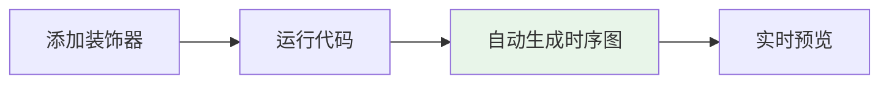
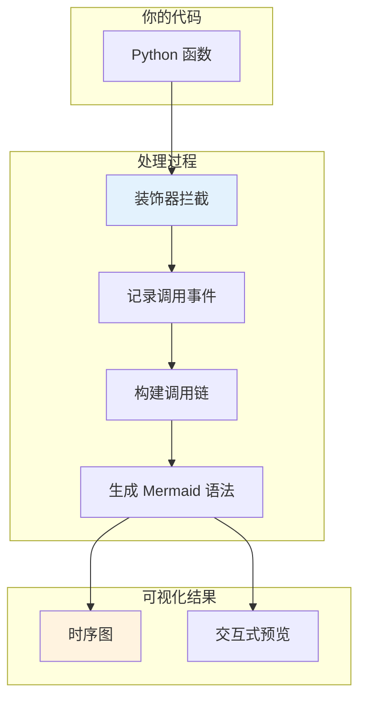
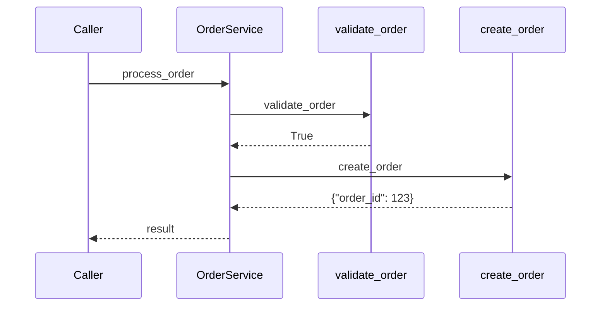
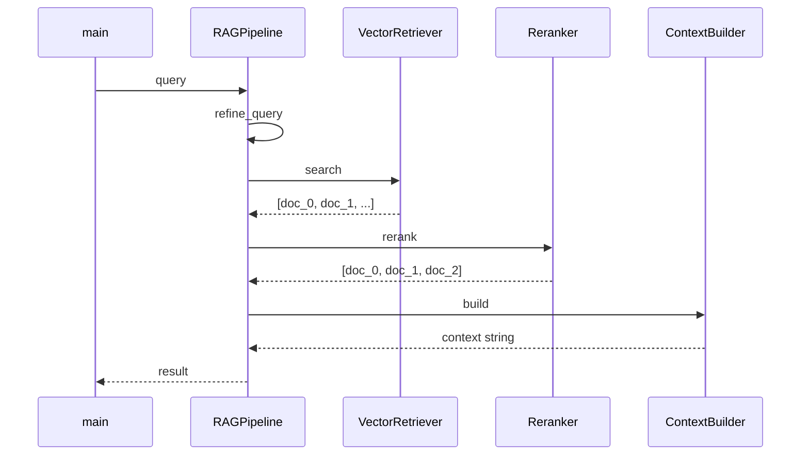
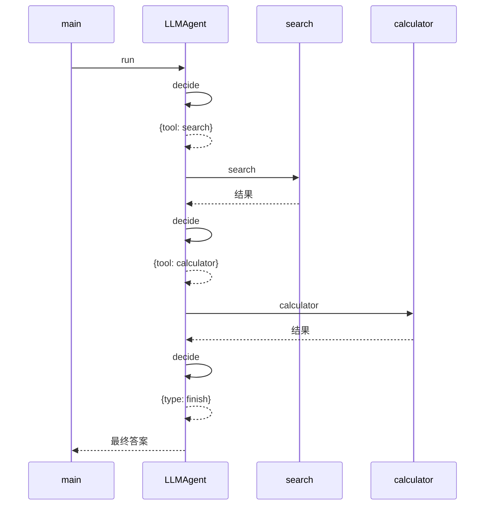
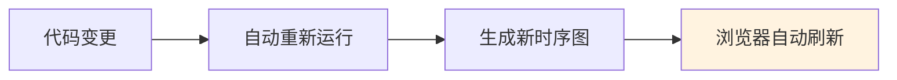

<div align="center">
  
  <h1><strong>玄同 765</strong></h1>
  <p><strong>大语言模型 (LLM) 开发工程师 | 中国传媒大学 · 数字媒体技术（智能交互与游戏设计）</strong></p>
  <p>
    <a href="https://blog.csdn.net/Yunyi_Chi" target="_blank" style="text-decoration: none;">
      <span style="background-color: #f39c12; color: white; padding: 2px 8px; border-radius: 4px; font-size: 12px; font-weight: bold; display: inline-block;">CSDN · 个人主页 |</span>
    </a>
    <a href="https://github.com/xt765" target="_blank" style="text-decoration: none; margin-left: 8px;">
      <span style="background-color: #24292e; color: white; padding: 2px 8px; border-radius: 4px; font-size: 12px; font-weight: bold; display: inline-block;">GitHub · Follow</span>
    </a>
  </p>
</div>

---

### **关于作者**

- **深耕领域**：大语言模型开发 / RAG 知识库 / AI Agent 落地 / 模型微调
- **技术栈**：Python | RAG (LangChain / Dify + Milvus) | FastAPI + Docker
- **工程能力**：专注模型工程化部署、知识库构建与优化，擅长全流程解决方案

> **「让 AI 交互更智能，让技术落地更高效」**
> 欢迎技术探讨与项目合作，解锁大模型与智能交互的无限可能！

---
# 【开源发布】MermaidTrace v0.7.1：让你的 Python 代码"画"出日志！
## 当你在凌晨两点调试递归调用时

你接手了一个遗留项目，代码结构复杂，函数层层嵌套。你打开日志文件，看到的是这样的输出：

```
[INFO] Entering process_order
[INFO] Entering validate_user
[INFO] Entering check_permission
[INFO] Exiting check_permission
[INFO] Entering get_user_info
[INFO] Exiting get_user_info
[INFO] Exiting validate_user
[INFO] Entering create_order
...
```

几百行日志，你试图在脑海中拼凑出调用关系。半小时后，你放弃了，决定手动画一个时序图。又过了两小时，图画好了——但第二天代码改了，图又过时了。

这不是假设，这是很多开发者的日常。**MermaidTrace** 的出现改变了这一切：只需添加一个装饰器，代码执行时就会自动生成时序图。



---

## MermaidTrace 是什么？

MermaidTrace 是一个专门的日志工具，它能**自动从代码执行中生成 Mermaid 时序图**。它特别适合：

- 可视化复杂业务逻辑
- 理解微服务交互流程
- 调试递归和异步代码
- 自动生成技术文档



### 核心价值

传统的日志是线性的文本，你需要阅读、理解、在脑海中重建调用关系。MermaidTrace 把这个过程自动化了——**日志变成了图**。

---

## 快速上手：三步开始

### 1. 安装

```bash
pip install mermaid-trace
```

### 2. 添加装饰器

```python
from mermaid_trace import trace, trace_class

@trace_class
class OrderService:
    """订单服务类"""
    
    def process_order(self, order_id: int) -> dict:
        """处理订单"""
        self.validate_order(order_id)
        return self.create_order(order_id)
    
    def validate_order(self, order_id: int) -> bool:
        """验证订单"""
        return order_id > 0
    
    def create_order(self, order_id: int) -> dict:
        """创建订单"""
        return {"order_id": order_id, "status": "created"}

# 运行代码
service = OrderService()
result = service.process_order(123)
```

### 3. 查看时序图

```bash
mermaid-trace serve flow.mmd
```

这会启动一个本地服务器，自动打开浏览器，展示生成的时序图：



---

## 在 LLM 应用中的实践

### 场景一：可视化 RAG 检索流程

RAG 系统的检索流程往往涉及多个步骤：查询改写、向量检索、重排序、上下文构建。用 MermaidTrace 可以清晰展示整个流程。

```python
from mermaid_trace import trace
from typing import List

@trace
class RAGPipeline:
    """RAG 检索管道"""
    
    def __init__(self):
        self.retriever = VectorRetriever()
        self.reranker = Reranker()
        self.context_builder = ContextBuilder()
    
    async def query(self, question: str) -> dict:
        # 查询改写
        refined_query = await self.refine_query(question)
        
        # 向量检索
        documents = await self.retriever.search(refined_query)
        
        # 重排序
        ranked_docs = await self.reranker.rerank(documents, question)
        
        # 构建上下文
        context = self.context_builder.build(ranked_docs)
        
        return {"query": question, "context": context}
```

生成的时序图清晰展示了 RAG 的完整流程：



### 场景二：追踪 LangChain Agent 执行

LangChain 的 Agent 执行流程复杂，涉及工具调用、决策循环、错误处理。MermaidTrace 可以帮你理解每一步发生了什么。

```python
from mermaid_trace import trace_class

@trace_class
class LLMAgent:
    """LLM Agent"""
    
    def __init__(self):
        self.tools = {"search": self.search, "calculator": self.calculator}
    
    async def run(self, query: str) -> str:
        for i in range(3):
            action = await self.decide(query)
            if action["type"] == "finish":
                return action["answer"]
            result = await self.tools[action["tool"]](action["input"])
        return "完成"
```

生成的时序图清晰展示了 Agent 的决策循环：



### 场景三：调试 FastAPI 异步流程

FastAPI 的异步处理流程难以追踪，MermaidTrace 可以帮你理解请求的完整生命周期。

```python
from fastapi import FastAPI, Depends
from mermaid_trace import trace

app = FastAPI()

@trace
class DatabaseService:
    async def get_user(self, user_id: int) -> dict:
        return {"id": user_id, "name": f"User{user_id}"}
    
    async def get_orders(self, user_id: int) -> list:
        return [{"id": i} for i in range(3)]

@app.get("/users/{user_id}")
async def get_user(user_id: int, db: DatabaseService = Depends(get_db)):
    user, orders = await asyncio.gather(
        db.get_user(user_id),
        db.get_orders(user_id)
    )
    return {"user": user, "orders": orders}
```

---

## 核心装饰器详解

### @trace - 函数级追踪

```python
from mermaid_trace import trace

@trace
def process_data(data: str) -> str:
    return data.upper()
```

### @trace_class - 类级追踪

```python
from mermaid_trace import trace_class

@trace_class
class MyService:
    def method_a(self):
        pass
```

### @trace_interaction - 交互追踪

```python
from mermaid_trace import trace_interaction

@trace_interaction
async def complex_operation():
    result = await step_one()
    return await step_two(result)
```

---

## CLI 工具

MermaidTrace 提供了内置的 CLI 工具，支持热重载和实时预览：

```bash
# 预览单个文件
mermaid-trace serve flow.mmd

# 预览目录
mermaid-trace serve ./diagrams

# 指定端口
mermaid-trace serve flow.mmd --port 3000

# 不自动打开浏览器
mermaid-trace serve flow.mmd --no-browser

# 查看版本
mermaid-trace version
```



**v0.7.1 新特性**：
- ✅ 完全离线支持：无需网络连接即可使用
- ✅ 简化安装：只需 `pip install mermaid-trace`

---

## 与 LangChain 的集成

MermaidTrace 提供了 LangChain 的专用处理器：

```python
from mermaid_trace.integrations.langchain import MermaidTraceCallbackHandler

handler = MermaidTraceCallbackHandler()

# 附加到 LangChain 执行
chain = LLMChain(llm=llm, prompt=prompt)
result = chain.run("你好", callbacks=[handler])

# 自动生成 LangChain 执行时序图
```

---

## 性能考虑

MermaidTrace 设计为低开销：

| 场景 | 开销 |
|:---|:---|
| 简单函数调用 | < 1ms |
| 异步操作 | 几乎无开销 |
| 深度递归 | 智能折叠 |

生产环境建议：

```python
import os
from mermaid_trace import set_enabled

# 根据环境变量控制
set_enabled(os.getenv("ENABLE_TRACE", "false").lower() == "true")
```

---

## 总结

| 场景 | MermaidTrace 的价值 |
|:---|:---|
| 接手遗留代码 | 一键生成调用关系图 |
| 调试异步流程 | 可视化并发执行顺序 |
| LLM Agent 开发 | 理解决策循环和工具调用 |
| 技术文档 | 自动生成时序图，永不过时 |
| RAG 系统 | 展示检索管道的完整流程 |

MermaidTrace 的核心理念是：**日志不应该是文本，而应该是图**。在 LLM 应用开发中，当执行流程越来越复杂时，可视化比阅读日志更高效。

一行装饰器，让你的代码自己"画"出执行流程。

---

## 参考资料

- **GitHub**: [xt765/mermaid-trace](https://github.com/xt765/mermaid-trace)
- **Gitee**: [xt765/mermaid-trace](https://gitee.com/xt765/mermaid-trace)
- **PyPI**: [mermaid-trace](https://pypi.org/project/mermaid-trace/)
- **在线体验**: [Colab Demo](https://colab.research.google.com/github/xt765/mermaid-trace/blob/main/examples/MermaidTrace_Demo.ipynb)

如果你觉得这个工具有所帮助，请在 GitHub 上给我一个 ⭐️ Star！
