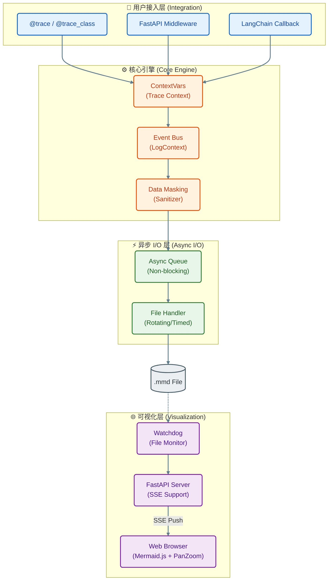
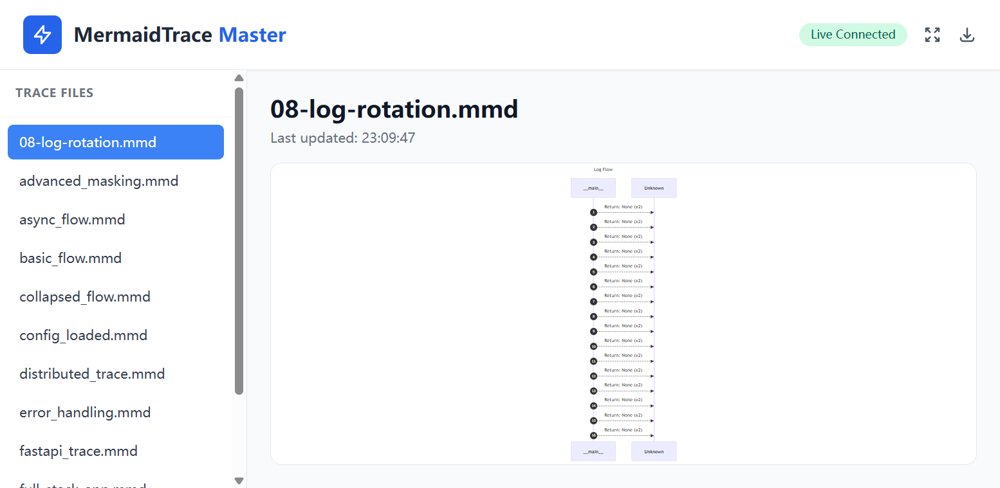
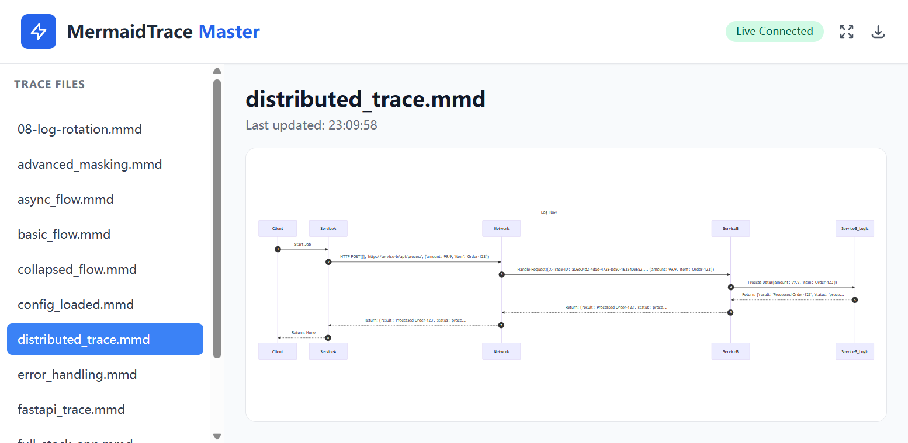

<div align="center">
  
  <h1><strong>玄同 765</strong></h1>
  <p><strong>大语言模型 (LLM) 开发工程师 | 中国传媒大学 · 数字媒体技术（智能交互与游戏设计）</strong></p>
  <p>
    <a href="https://blog.csdn.net/Yunyi_Chi" target="_blank" style="text-decoration: none;">
      <span style="background-color: #f39c12; color: white; padding: 2px 8px; border-radius: 4px; font-size: 12px; font-weight: bold; display: inline-block;">CSDN · 个人主页 |</span>
    </a>
    <a href="https://github.com/xt765" target="_blank" style="text-decoration: none; margin-left: 8px;">
      <span style="background-color: #24292e; color: white; padding: 2px 8px; border-radius: 4px; font-size: 12px; font-weight: bold; display: inline-block;">GitHub · Follow</span>
    </a>
  </p>
</div>

---

### **关于作者**

- **深耕领域**：大语言模型开发 / RAG 知识库 / AI Agent 落地 / 模型微调
- **技术栈**：Python | RAG (LangChain / Dify + Milvus) | FastAPI + Docker
- **工程能力**：专注模型工程化部署、知识库构建与优化，擅长全流程解决方案

> **「让 AI 交互更智能，让技术落地更高效」**
> 欢迎技术探讨与项目合作，解锁大模型与智能交互的无限可能！

---

# MermaidTrace v0.7.0：重构 Python 调用链可视化的新范式

**日期**: 2026-02-24
**作者**: 玄同765

### **前言：从“黑盒”到“全景图”**

在微服务和 AI Agent 盛行的今天，系统的**可观测性 (Observability)** 面临着前所未有的挑战：
*   **日志 (Log)** 过于琐碎，难以还原完整的业务上下文。
*   **分布式追踪 (Trace)** 如 Jaeger/Zipkin 虽然强大，但部署沉重，且往往侧重于运维监控而非开发调试。
*   **代码阅读** 随着项目迭代，函数调用关系变得错综复杂，"屎山"代码难以维护。

**MermaidTrace** 的诞生正是为了解决这一痛点。它秉持 **"Code-as-Diagram"** 的理念，通过极低侵入性的装饰器，将 Python 代码的运行时逻辑实时转化为清晰、美观的 Mermaid 时序图。

**v0.7.0** 是一个里程碑式的版本，我们不仅统一了 CLI 体验，更在分布式追踪、数据隐私和高性能 I/O 上取得了突破。

---

### **核心架构解析 (Architecture Deep Dive)**

MermaidTrace 之所以能做到“轻量”与“强大”并存，得益于其分层解耦的架构设计：



1.  **上下文保持 (Context Propagation)**: 核心利用 Python 的 `contextvars`，确保在 `asyncio` 协程切换或线程池调度时，Trace ID 不会丢失，从而完美支持异步并发场景。
2.  **高性能 I/O**: 采用**生产者-消费者模型**。业务线程只需将事件推入无锁队列 (Async Queue)，由独立的后台线程负责文件写入，主线程阻塞耗时几乎为零。
3.  **实时反馈回路**: 通过 Watchdog 监听文件变动，结合 Server-Sent Events (SSE) 技术，实现代码运行完毕，浏览器图表即刻刷新的流畅体验。

---

### **v0.7.0 关键特性 (Key Features)**

#### **1. 统一的 CLI 体验**
我们彻底重构了命令行工具。现在，`mermaid-trace serve` 是唯一的入口。它会自动检测目标是文件还是目录，并智能启动增强型 Web 服务器。

*   **智能降级**: 如果未安装 `fastapi`，它会给出清晰的安装指引，而不是直接报错。
*   **交互增强**: 默认支持图表缩放、平移和多文件切换。

#### **2. 分布式追踪模拟**
随着微服务架构的普及，跨服务的调用追踪变得至关重要。v0.7.0 支持 **W3C Trace Context** 和 **B3** 标准。

*   **自动注入**: FastAPI 中间件会自动解析请求头中的 Trace ID。
*   **链路串联**: 即使跨越多个 HTTP 请求，生成的时序图也能保持逻辑连贯。

#### **3. 数据隐私与脱敏**
在金融或企业级应用中，敏感数据（如密码、Token）绝对不能落盘。我们引入了 `DataMasker`：
*   **递归脱敏**: 自动遍历字典、列表和对象属性。
*   **模式匹配**: 支持正则匹配字段名（如 `password`, `secret`），自动替换为 `***`。

---

### **实战场景 (Use Cases)**

#### **场景一：遗留系统重构**
面对几十万行的“屎山”代码，只需在关键类上添加 `@trace_class`，运行一次业务流程，即可得到一张完整的调用关系图，快速理清依赖关系。

#### **场景二：AI Agent 调试**
AI Agent 的决策路径往往是不确定的。通过 `MermaidTraceCallbackHandler`，你可以清晰地看到 Agent 是如何进行思考 (Thought)、调用工具 (Action) 并得出结论 (Observation) 的。

#### **场景三：性能瓶颈定位**
利用时序图的垂直长度和时间戳，可以直观地发现哪个函数调用耗时过长，或者哪里发生了不必要的串行调用。

---

### **快速上手：三步开启可视化之旅**

#### **1. 安装**
```bash
pip install mermaid-trace[server]
```

#### **2. 编码**
```python
from mermaid_trace import trace, configure_flow

configure_flow("flow.mmd", overwrite=True)

@trace(source="User", target="App")
def hello():
    return "World"

hello()
```

#### **3. 预览**
```bash
mermaid-trace serve flow.mmd
```

---

### **总结与展望**

MermaidTrace 的初衷很简单：**让代码逻辑一目了然**。它是真实、低侵入、可视化且可扩展的。

未来，我们将探索：
- [ ] **性能热力图**：在时序图中直观展示函数耗时瓶颈。
- [ ] **IDE 插件**：直接在 VS Code / PyCharm 中预览交互图。
- [ ] **OpenTelemetry 导出**：支持将数据导出到 Jaeger 等专业 APM 平台。

如果你觉得这个工具有所帮助，请在 GitHub 上给我一个 ⭐️ Star！

- **GitHub**: [xt765/mermaid-trace](https://github.com/xt765/mermaid-trace)
- **Gitee**: [xt765/mermaid-trace](https://gitee.com/xt765/mermaid-trace)
