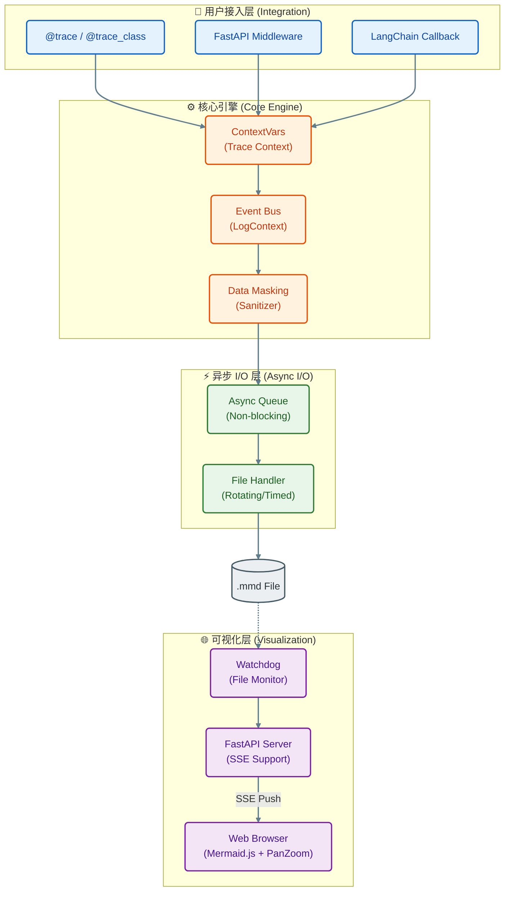

# MermaidTrace v0.7.0：重构 Python 调用链可视化的新范式

**日期**: 2026-02-24  
**作者**: 玄同765

---

### **引言：从“盲人摸象”到“全景透视”**

在现代软件工程中，**可观测性 (Observability)** 已成为系统稳定性的基石。我们通常依赖 Log（日志）、Trace（追踪）和 Metric（指标）这“三驾马车”来洞察系统状态。然而，在实际开发中，特别是面对复杂的异步调用和微服务架构时，我们常常陷入困境：

*   **日志碎片化**：海量的文本日志如同散落的拼图，难以在脑海中还原出完整的业务执行流。
*   **追踪重型化**：传统的 APM（如 Jaeger, SkyWalking）部署复杂，且往往用于生产环境监控，难以在本地开发阶段提供即时反馈。
*   **异步上下文丢失**：在 `asyncio` 高并发场景下，协程的频繁切换导致调用链路断裂，传统的 ThreadLocal 方案失效。

**MermaidTrace** 的诞生正是为了解决这些痛点。它秉持 **"Code-as-Diagram"**（代码即图表）的理念，通过轻量级的装饰器和实时渲染引擎，将晦涩的运行时逻辑瞬间转化为直观的 Mermaid 时序图。

随着 **v0.7.0** 的发布，我们引入了统一的 CLI 体验、分布式追踪支持以及企业级的数据安全特性，标志着 MermaidTrace 从一个开发者工具进化为生产可用的可视化追踪方案。

---

### **核心架构解析 (Architecture Deep Dive)**

MermaidTrace 的设计遵循“非侵入、高性能、异步优先”的原则。以下是 v0.7.0 的核心架构图：



#### **1. 上下文保持 (Context Propagation)**
在 Python 3.7+ 的异步生态中，`threading.local` 已无法满足需求。MermaidTrace 核心基于 `contextvars` 模块，为每个协程维护独立的 `TraceContext`。
*   当协程 `await` 挂起时，上下文随之保存；恢复执行时，上下文自动还原。
*   通过 `copy_context().run()`，我们甚至能在线程池（`run_in_executor`）中保持追踪链路的连续性。

#### **2. 高性能异步 I/O (Async I/O)**
为了最小化对业务性能的影响，MermaidTrace 采用了**双层缓冲机制**：
1.  装饰器捕获事件后，立即推入内存中的 `asyncio.Queue`（无锁，极快）。
2.  独立的后台线程（Writer Thread）批量从队列取出事件，写入磁盘。
这种设计确保了主业务线程几乎零阻塞（Zero-Blocking），即使在高并发场景下也能保持系统吞吐量。

#### **3. 实时反馈回路 (Real-time Feedback)**
v0.7.0 的 CLI 重构了预览体验。通过集成 `Watchdog` 文件监控和 `Server-Sent Events (SSE)` 技术，当 `.mmd` 文件发生任何字节级变动时，浏览器端会在毫秒级内收到推送并自动重绘。这种“修改代码 -> 保存 -> 图表即时更新”的体验，让调试过程如丝般顺滑。

---

### **v0.7.0 关键特性 (Key Features)**

#### **1. 统一的 CLI 体验**
我们废弃了复杂的参数组合，现在只需一个命令：
```bash
mermaid-trace serve [path]
```
无论你指向单个文件还是项目根目录，系统都会自动启动增强型 Web 服务器，支持热重载、目录浏览和交互式缩放。

#### **2. 分布式追踪 (Distributed Tracing)**
微服务架构下，调用链往往跨越多个进程。v0.7.0 支持标准的 Trace Context 传播：
*   **注入 (Inject)**: 客户端发起请求时，自动将 `X-Trace-ID` 或 W3C `traceparent` 注入 HTTP Header。
*   **提取 (Extract)**: 服务端中间件自动解析 Header，将当前的 Trace 上下文与上游链路无缝拼接。

#### **3. 数据隐私与安全 (Privacy & Security)**
日志中意外泄露敏感数据是合规的大忌。新版引入了智能脱敏器 (`DataMasker`)：
*   **自动识别**: 根据配置的关键词（如 `password`, `token`, `secret`）自动扫描参数和返回值。
*   **递归清洗**: 支持深度遍历字典、列表和对象属性，将敏感值替换为 `***`。

---

### **实战场景：MermaidTrace 能为你做什么？**

#### **场景一：遗留系统重构 (Legacy Code Refactoring)**
面对缺乏文档的“屎山”代码，直接阅读源码往往一头雾水。
*   **解法**: 使用 `@trace_class` 一键装饰核心类，运行单元测试。
*   **效果**: 自动生成完整的类方法调用时序图，理清依赖关系和调用顺序，为重构提供可视化蓝图。

#### **场景二：AI Agent 调试 (AI Agent Debugging)**
LangChain 等框架构建的 Agent 逻辑复杂，包含大量的思维链（CoT）和工具调用。
*   **解法**: 集成 `MermaidTraceCallbackHandler`。
*   **效果**: 将 Agent 的思考（Thought）、行动（Action）和观察（Observation）过程可视化，帮助开发者直观地优化 Prompt 和决策逻辑。

#### **场景三：微服务排错 (Microservices Troubleshooting)**
某服务响应偶尔变慢，但不知道是哪个下游服务的问题。
*   **解法**: 在所有服务中集成 `MermaidTraceMiddleware`。
*   **效果**: 生成跨服务的全局时序图，配合时间戳，一眼定位到耗时最长的网络调用或数据库查询。

---

### **快速上手 (Quick Start)**

```python
# 1. 安装
# pip install mermaid-trace[server]

from mermaid_trace import trace, configure_flow

# 2. 配置
configure_flow("app.mmd")

# 3. 装饰
@trace(source="Client", target="Server")
def main():
    process_request()

@trace(source="Server", target="Database")
def process_request():
    return "Data"

if __name__ == "__main__":
    main()
```

启动预览：
```bash
mermaid-trace serve app.mmd
```

---

### **写在最后：关于作者与未来**

MermaidTrace 的愿景是成为 Python 生态中最易用的可视化追踪工具。未来，我们将继续探索：
*   **性能热力图**: 在时序图中直观展示函数耗时瓶颈。
*   **IDE 插件**: 直接在 VS Code / PyCharm 中预览图表。
*   **OpenTelemetry 支持**: 将 MermaidTrace 作为 OTel 的可视化后端。

如果你觉得这个工具有所帮助，请在 GitHub 上给我一个 ⭐️ Star！

- **GitHub**: [xt765/mermaid-trace](https://github.com/xt765/mermaid-trace)
- **Gitee**: [xt765/mermaid-trace](https://gitee.com/xt765/mermaid-trace)

---

<div align="center">
  
  <p><strong>玄同 765</strong></p>
  <p>大语言模型开发 | 智能交互设计 | 全栈工程师</p>
</div>
