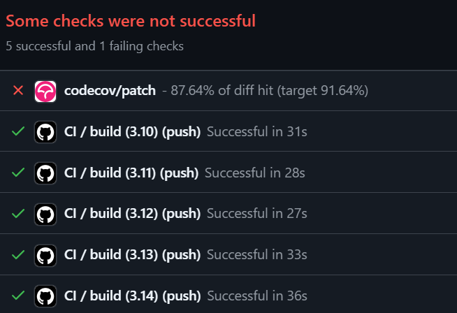

# 文件: src/mermaid_trace/core/context.py

## 概览
本文件实现了 `LogContext` 类，负责管理全局执行上下文。它是整个追踪系统能够正确处理并发和异步调用的核心。

## 核心功能分析

### ContextVars
MermaidTrace 使用 Python 3.7+ 引入的 `contextvars` 模块。
-   **线程安全与异步安全**：与传统的 `threading.local()` 不同，`ContextVar` 能够原生支持 `asyncio` 的 Event Loop。这意味着当一个协程 `await` 并挂起时，其上下文状态会被保留；当它恢复执行时，上下文也会自动恢复。
-   **隔离性**：不同的 Task 或 Thread 拥有独立的上下文副本，互不干扰。

### Scope 管理
`LogContext` 提供了 `scope`（同步）和 `ascope`（异步）两个上下文管理器。
-   **Copy-on-Write**：在进入新的 scope 时，它会复制当前的上下文字典，修改副本，然后设置为当前上下文。
-   **自动恢复**：在退出 scope 时（无论是正常退出还是异常退出），它利用 `token` 将上下文重置为进入前的状态。这构建了一个栈式的上下文管理机制，完美支持嵌套调用（A -> B -> C，C 返回后 B 的上下文自动恢复）。

## 源代码与中文注释

```python
from contextvars import ContextVar, Token
from contextlib import asynccontextmanager, contextmanager
from typing import Any, AsyncIterator, Dict, Iterator
import uuid

class LogContext:
    """
    管理用于日志记录的全局上下文信息（例如，request_id, user_id, current_participant）。
    
    此类利用 `contextvars.ContextVar` 来确保线程安全以及在异步 (asyncio) 环境中的正确上下文传播。
    与 `threading.local()` 不同，`ContextVar` 原生支持 Python 的 async/await 事件循环，
    确保上下文在 `await` 点之间保留，但在不同的并发任务之间隔离。
    """
    
    # ContextVar 是这里的关键机制。
    # 它存储对当前执行上下文（Task/Thread）唯一的字典。
    # "log_context" 是变量的名称，用于调试。
    # 如果未设置，默认值隐式为空状态（在 _get_store 中处理）。
    _context_store: ContextVar[Dict[str, Any]] = ContextVar("log_context")

    @classmethod
    def _get_store(cls) -> Dict[str, Any]:
        """
        检索当前上下文字典。
        
        如果在当前上下文中未设置上下文变量，它会创建一个新的空字典，
        将其设置到 contextvar 中，然后返回它。这防止了 LookupError 并确保始终
        有一个有效的字典可用，同时解决了后续调用可能抛出异常的问题。
        """
        try:
            return cls._context_store.get()
        except LookupError:
            empty_dict: Dict[str, Any] = {}
            cls._context_store.set(empty_dict)
            return empty_dict

    @classmethod
    def set(cls, key: str, value: Any) -> None:
        """
        在当前上下文中设置特定的键值对。
        
        重要：ContextVars 是不可变集合。要修改上下文，我们必须：
        1. 检索当前字典。
        2. 创建浅拷贝（以避免影响父上下文，如果我们重用对象的话）。
        3. 更新副本。
        4. 使用新字典重新设置 ContextVar。
        """
        ctx = cls._get_store().copy()
        ctx[key] = value
        cls._context_store.set(ctx)

    @classmethod
    def update(cls, data: Dict[str, Any]) -> None:
        """
        一次更新当前上下文中的多个键。
        
        这遵循与 `set()` 相同的 Copy-Update-Set 模式以维护上下文隔离。
        """
        if not data:
            return
        ctx = cls._get_store().copy()
        ctx.update(data)
        cls._context_store.set(ctx)

    @classmethod
    def get(cls, key: str, default: Any = None) -> Any:
        """
        安全地从当前上下文检索值。
        """
        return cls._get_store().get(key, default)

    @classmethod
    def get_all(cls) -> Dict[str, Any]:
        """
        返回整个上下文字典的副本。
        """
        return cls._get_store().copy()

    @classmethod
    @contextmanager
    def scope(cls, data: Dict[str, Any]) -> Iterator[None]:
        """
        用于临时上下文更新的同步上下文管理器。
        
        用法:
            with LogContext.scope({"user_id": 123}):
                # 这里 user_id 是 123
                some_function()
            # 这里 user_id 恢复为之前的值（或消失）
            
        机制:
            1. 复制当前上下文并用新数据更新它。
            2. 将 ContextVar 设置为此新状态，接收一个 `Token`。
            3. 将控制权交给代码块。
            4. 最后，使用 `Token` 将 ContextVar 重置为进入代码块之前的确切状态。
        """
        current_ctx = cls._get_store().copy()
        current_ctx.update(data)
        token = cls._context_store.set(current_ctx)
        try:
            yield
        finally:
            # 关键：Reset 将上下文恢复为 .set() 之前的状态
            cls._context_store.reset(token)

    @classmethod
    @asynccontextmanager
    async def ascope(cls, data: Dict[str, Any]) -> AsyncIterator[None]:
        """
        用于协程中临时上下文更新的异步上下文管理器。
        
        用法:
            async with LogContext.ascope({"request_id": "abc"}):
                await some_async_function()
                
        这在功能上与 `scope` 相同，但专为 `async with` 块设计。
        它确保即使 `yield` 内部的代码挂起执行 (await)，该任务的上下文仍然有效。
        """
        current_ctx = cls._get_store().copy()
        current_ctx.update(data)
        token = cls._context_store.set(current_ctx)
        try:
            yield
        finally:
            cls._context_store.reset(token)

    # 如果需要，用于向后兼容的别名
    ascope_async = ascope

    @classmethod
    def set_all(cls, data: Dict[str, Any]) -> Token[Dict[str, Any]]:
        """
        用提供的数据替换整个上下文。
        返回一个 Token，以后可用于手动重置上下文。
        """
        return cls._context_store.set(data.copy())

    @classmethod
    def reset(cls, token: Token[Dict[str, Any]]) -> None:
        """
        使用从 `set` 或 `set_all` 获得的 Token 手动重置上下文。
        """
        cls._context_store.reset(token)

    @classmethod
    def current_participant(cls) -> str:
        """
        获取 'participant' 字段的助手，代表当前活跃的对象/模块。
        如果未设置，默认为 'Unknown'。
        """
        return str(cls.get("participant", "Unknown"))

    @classmethod
    def set_participant(cls, name: str) -> None:
        """
        设置 'participant' 字段的助手。
        """
        cls.set("participant", name)

    @classmethod
    def current_trace_id(cls) -> str:
        """
        检索当前 Trace ID 以关联单个流中的事件。
        
        延迟初始化逻辑:
        如果当前上下文中不存在 trace_id，它会生成一个新的 UUIDv4 并立即设置它。
        这确保了：
        1. 当被请求时，Trace ID 总是可用的。
        2. 一旦生成，相同的 ID 在上下文持续期间（除非手动更改）保持不变，将所有后续日志链接在一起。
        """
        tid = cls.get("trace_id")
        if not tid:
            tid = str(uuid.uuid4())
            cls.set("trace_id", tid)
        return str(tid)

    @classmethod
    def set_trace_id(cls, trace_id: str) -> None:
        """
        手动设置 Trace ID（例如，从传入的 HTTP 请求头）。
        """
        cls.set("trace_id", trace_id)
```
